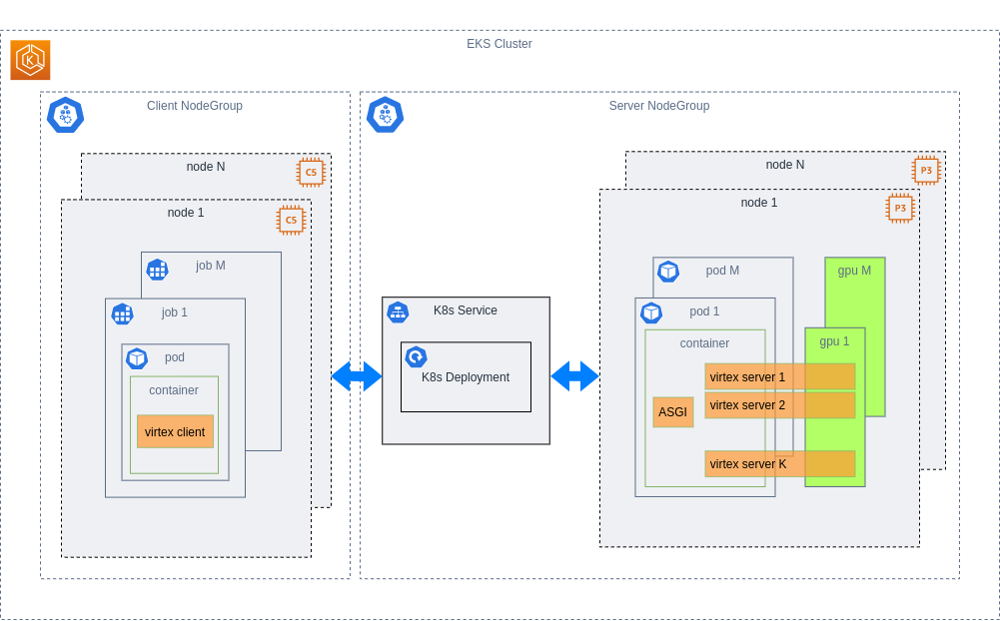
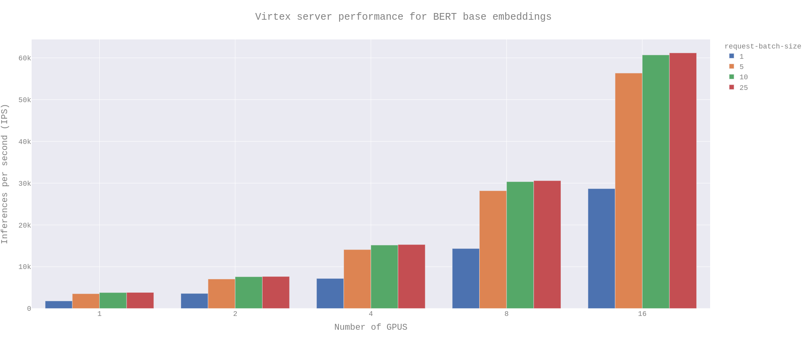

## Virtex Benchmarks
This repository contains a benchmarking suite for the Virtex serving framework. To run this suite you will need an AWS account with access to p3 GPU instances (you may need to submit a request to AWS to increase your P2/P3 quota), and properly configured `aws`, `eksctl`, and `kubectl` command line tools installed on your local machine. Alternatively, you can run tests locally via the `run.sh` script, making sure to configure the test using the environment variables in `localenv.sh`.

This benchmark suite contains off-the-shelf implementations of two common machine learning tasks: 1) serving BERT embeddings and 2) ResNet50 image classification. These implementations are taken from the Transormers and TorchVision libraries, respectively, which run very competetively with Virtex on commodity V100s despite not being highly optimized implementations of those models (such as those on the [ML Commons Inference leaderboard](https://mlcommons.org/en/inference-datacenter-07/)).

&nbsp;

### Architecture
The virtex benchmarks are run in a K8s cluster containing cpu and gpu nodes, the former used to generate http load, the latter used for servers. If you are using this as a template for a virtex deployment, you can modify the `eks/cluster-gpu.yaml` file according to your needs. When doing so, it is helpful to understand how virtex is designed in order to squeeze performance out of any given combination of model and hardware. At the lowest level, virtex grabs a full copy of your model, forks it onto a configurable number of python processes each with it's own slice of GPU memory, and exposes each model with a dedicated http server running on an asyncronous event loop behind a ASGI process manager. With this in mind, you'll want to know how much memory your model occupies on the GPU, how many processing threads are available on the machine, and of course, how many GPUs there are. Combining these variables gives you a formula to determine the amount of parallelism that can be achieved on a single machine:

$\text{num\_server\_threads} = \text{gpus\_per\_node} \times (\text{memory\_per\_model // memory\_per\_gpu})$

keeping in mind the constraint that `num_server_threads_per_node` must not exceed the number of vCPUs on the machine. We can design a distributed application around this using the abstractions that Kubernetes provides. With N nodes each containing `gpus_per_node` number of GPUs, we're going to create a deployment with a number of replica pods equal to `gpus_per_node` multiplied by the number of server nodes. As a concrete example, if your cluster has three `p3.16xlarge` instances (8 Tesla V100s each), the number of replicas in your deployment is going to be 24. The number of virtex worker instances per pod is going to be equal to the floor division term in the above equation. As a concrete example, each V100 has 16GB of memory, so if our model is 5GB, then the total number of server instances per pod will be 3, which means the total number of server instances running on the three instances will be 72. In front of this deployment will be a Kuberenetes Service with a load balancer for routing http traffic to the server pods. This architecture is summarized below.

It's worth noting that while GPU virtualization does exist, here we opt to (effectively) pin a GPU to each server pod. This design makes the assumption that the remainder of the floor division term in the above equation is fairly small relative to the GPU memory; if it is not, you may want to consider a GPU with more memory, or alternatively increase the number of GPUs available to each pod while increasing the number of virtex workers in each pod. The remainder of that floor division represents wasted GPU memory.

### Results

Running the above architecture will yield results similar to those shown below. This test was configured as follows (The node resource requests and limits are specified in the `k8s/` folder):

- 2 $\times$ p3.16xlarge instances (16 Tesla V100s)
- `num_clients=5 to 25`
- `rps_per_client=3500`
- `max_batch_size=144`
- `max_time_on_queue=0.01`
- `max_concurrent_connections=50000`
- `sequence_length=10`

The K8s load balancer used in combination with the asyncronous gateway interface gives us near linear scaling as we increase the number of GPUs from 1 to 16. On a cost basis, Virtex allows us to serve anywhere from 2.2-4.5M embeddings per US dollar (depending on whether client batching is used) using the AWS infrastructure outlined above. 

It should be noted that this implementation is far from optimal in terms of performance. In a production setting, one would want to use an implementation that is optimized at the kernel level, and also quantize the network to increase the native speed of the model and enable a larger number of model instances to fit on each GPU.